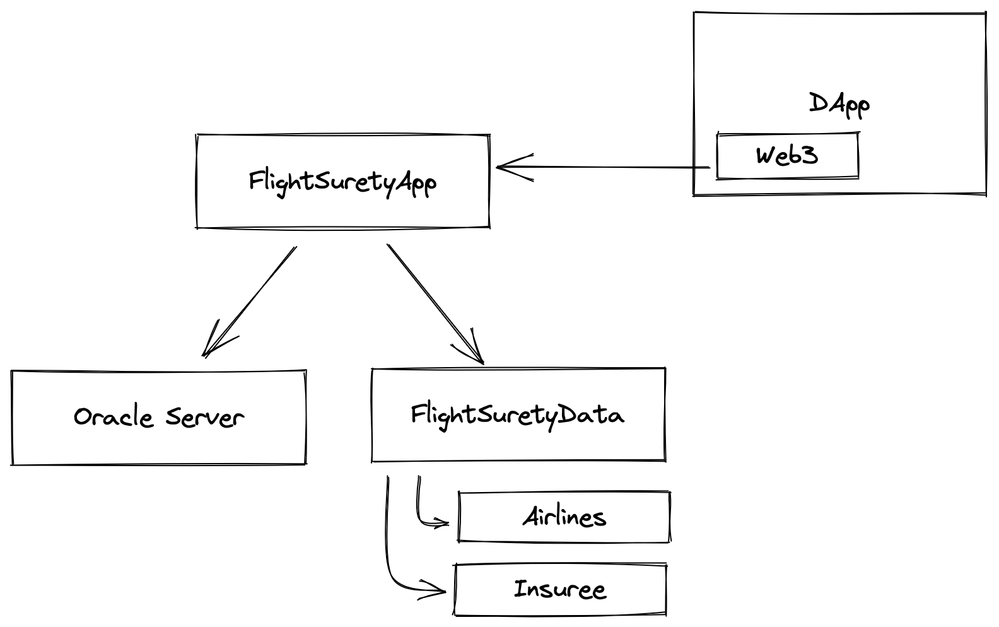
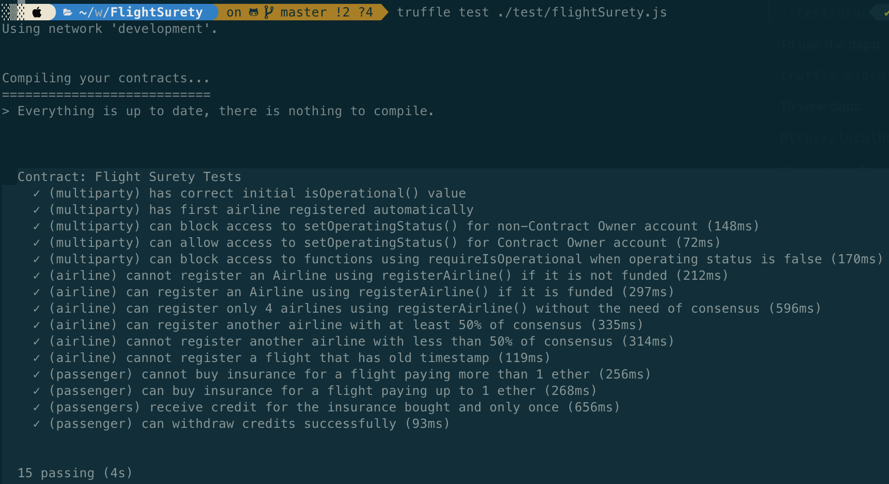

# FlightSurety

FlightSurety is a sample application project for Udacity's Blockchain course.

## Diagram

## Goals

- Separation of Concerns
  - FlightSuretyData contract for data persistence
  - FlightSuretyApp contract for app logic and oracles code
  - Dapp client for triggering contract calls
- Airlines
  - Register first airline when contract is deployed
  - Only existing airline may register a new airline until there are at least four airlines registered
  - Registration of fifth and subsequent airlines requires multi-party consensus of 50% of registered airlines
- Passengers
  - Passengers may pay upto 1 ether for purchasing flight insurance
  - Flight numbers and timestamps are fixed for the purpos of the project and can be defined in the Dapp client
  - If flight is delayed due to airline fault, passenger receives credit of 1.5x the amount they paid
- Oracles
  - Implemented as a server app
  - Upon startup, 20+ oracles are registered
  - Client dapp is used to trigger request to update flight status generating OracleRequest event that is captured by server
  - Server will loop through all registered oracles and respond by calling in app logic contract with the appropriate status code
- General
  - Contracts must have operational status control
  - Functions must fail fast

## Tests

## Install

This repository contains Smart Contract code in Solidity (using Truffle), tests (also using Truffle), dApp scaffolding (using HTML, CSS and JS) and server app scaffolding.

To install, download or clone the repo, then:

`npm install`
`truffle compile`

## Develop Client

To run truffle tests:

`truffle test ./test/flightSurety.js`
`truffle test ./test/oracles.js`

To use the dapp:

`truffle migrate`
`npm run dapp`

To view dapp:

`http://localhost:8000`

## Develop Server

`npm run server`
`truffle test ./test/oracles.js`

## Deploy

To build dapp for prod:
`npm run dapp:prod`

Deploy the contents of the ./dapp folder

## Deploy to Rinkeby

truffle migrate --reset --network rinkeby

## Resources

* [How does Ethereum work anyway?](https://medium.com/@preethikasireddy/how-does-ethereum-work-anyway-22d1df506369)
* [BIP39 Mnemonic Generator](https://iancoleman.io/bip39/)
* [Truffle Framework](http://truffleframework.com/)
* [Ganache Local Blockchain](http://truffleframework.com/ganache/)
* [Remix Solidity IDE](https://remix.ethereum.org/)
* [Solidity Language Reference](http://solidity.readthedocs.io/en/v0.4.24/)
* [Ethereum Blockchain Explorer](https://etherscan.io/)
* [Web3Js Reference](https://github.com/ethereum/wiki/wiki/JavaScript-API)